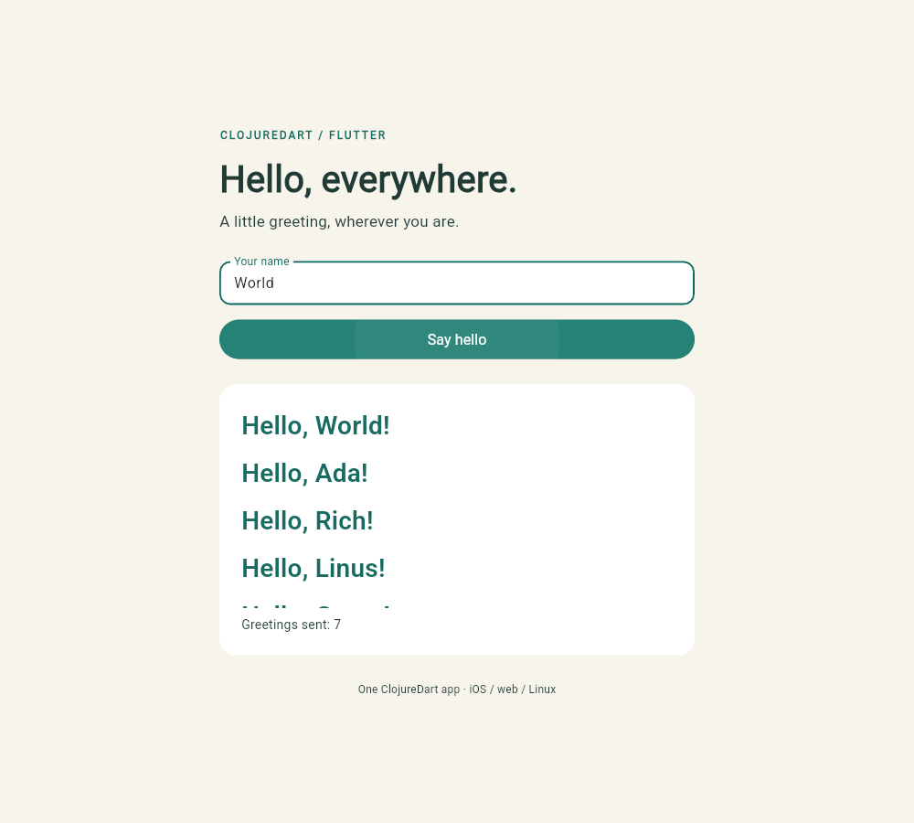

# ClojureDart: Hello, everywhere

One Flutter app for **iOS, web, and native Linux**. Enter a name and press
**Say hello** (or submit from the keyboard). An atom stores every submitted
greeting, including duplicates; `cljd.flutter` watches it and rebuilds the screen. The list shows newest greetings first and
scrolls as it grows. History lasts for the current app session. A managed
`TextEditingController` follows the widget lifecycle. Blank names greet the world.
The bundled [Noto Emoji font](https://github.com/google/fonts/tree/main/ofl/notoemoji)
provides a consistent fallback for emoji; its [OFL license](assets/fonts/OFL.txt)
is included. Text fields and greetings also use bundled
[Roboto](https://github.com/google/fonts/tree/main/ofl/roboto) with its
[OFL license](assets/fonts/OFL-Roboto.txt), so native Linux does not rely on
system font fallback to render Latin text.

The application is [one ClojureDart namespace](src/hello/main.cljd). Flutter's
generated platform runners host it; the UI and state logic are ClojureDart.

| Target | Verified on 11 September 2026 | Preview |
| --- | --- | --- |
| Web | Release build; Chromium form input, Unicode, trimming, blank fallback, keyboard submission and counter checks | [Screenshot](screenshot-web.png) |
| Linux | Native AArch64 release executable and GTK window under Xvfb; native integration tests | [Screenshot](screenshot-linux.png) |
| iOS | iPhone 17 simulator, iOS 26.5; build, install, launch and integration tests on the Mac host | [Screenshot](screenshot-ios.png) |

The greeting history has been checked with Flutter widget tests, native Linux
integration tests (ordering, duplicates, and scrolling), and Chromium submissions.
The iOS check predates the history addition and uses a simulator, not a physical
device or an App Store build.
Linux runs directly on this VM using its native Clang, Ninja, GTK, and Flutter SDK;
release build and integration tests passed without Docker.

## Toolchains

Tested with Flutter **3.47.3**, Dart **3.13.3**, and ClojureDart
**0.9.20260822a** (pinned in [deps.edn](deps.edn)). Flutter's tested commit is
`e8113bf45620cbeb8aff64947ee4c93e16adb4cf`.
Install the [Clojure CLI](https://clojure.org/guides/install_clojure) and
[Flutter](https://docs.flutter.dev/install), and put both on `PATH`.

The toolchains installed for this workspace are:

- VM: `../../.cache/flutter` from this directory.
- Mac: `~/clojure-dialects-demos/toolchains/flutter`.

Compile the ClojureDart source before invoking Flutter:

```sh
cd examples/clojuredart
# This workspace's Linux SDK; omit if Flutter is already on PATH.
export PATH="$PWD/../../.cache/flutter/bin:$PATH"
clojure -M:cljd compile
flutter test
```

## Web

Run these commands from `examples/clojuredart` (the server resolves `build/web`
relative to your current directory):

```sh
flutter build web --release --no-web-resources-cdn
python3 -m http.server 8074 --bind 127.0.0.1 --directory build/web
```

Open <http://127.0.0.1:8074>. The build includes CanvasKit locally. To repeat the
browser checks (stop that server first):

```sh
npm ci
npx playwright install chromium
npm run test:web
```

The browser test activates Flutter's accessibility semantics and uses its
textbox/button controls. It waits for animation frames when editing input,
because Flutter synchronizes its accessible DOM with the rendered widget tree.

## Native Linux

With Flutter's Linux desktop dependencies installed:

```sh
flutter run -d linux
# If the window flickers in the VM, use Mesa software rendering:
# LIBGL_ALWAYS_SOFTWARE=1 flutter run -d linux
flutter build linux --release
```

On this ARM64 VM, [linux.sh](linux.sh) locates Flutter on PATH, in `FLUTTER_SDK`,
or in the workspace's `.cache/flutter`. It runs commands directly on the host:

```sh
./linux.sh                         # flutter run -d linux
./linux.sh flutter build linux --release
./linux.sh xvfb-run -a flutter test integration_test/app_test.dart -d linux
./linux.sh xvfb-run -a -s '-screen 0 1280x800x24' ./capture-linux.sh
```

Native builds need Clang, CMake, Ninja, pkg-config, GTK 3 and liblzma development
files. Headless checks use Xvfb and xauth; screenshots additionally need xdotool
and ImageMagick. These are installed on the VM.

The release application is `build/linux/arm64/release/bundle/cljd_clojuredart`;
keep its `data/` and `lib/` directories alongside it. The original
[container wrapper](linux-container.sh) remains an optional fallback. If switching
between host and container builds, remove `build/linux` first to discard CMake's
cached compiler paths.

## Distributing desktop apps

Users do not need Flutter, Dart, or Clojure installed. Flutter normally produces
an app bundle containing the executable, runtime libraries, and assets rather
than a single self-contained executable.

| Platform | What to distribute |
| --- | --- |
| macOS | An `.app` bundle, usually zipped or packaged in a DMG. See the [release guide](https://docs.flutter.dev/deployment/macos). |
| Windows | The `.exe`, DLLs, assets, and Visual C++ runtime, together in a zip or installer. See the [packaging guide](https://docs.flutter.dev/platform-integration/windows/building#building-your-own-zip-file-for-windows). |
| Linux | The entire `bundle/` directory. The destination still needs compatible system libraries, including GTK; portability between distributions requires checking those dependencies. See the [distribution guide](https://docs.flutter.dev/platform-integration/linux/building#prepare-linux-apps-for-distribution). |

For this demo's verified Linux ARM64 release, distribute
`build/linux/arm64/release/bundle/`, keeping the executable, `lib/`, and `data/`
together. The macOS and Windows entries describe Flutter's packaging options;
this example has not been built or tested for those desktop targets.

## iOS

On a Mac with Xcode, copy this project, add Flutter and Clojure to `PATH`, then:

```sh
clojure -M:cljd compile
flutter build ios --simulator --debug
flutter devices
flutter run -d <simulator-id>
flutter test integration_test/app_test.dart -d <simulator-id>
```

The verified copy is on the Mac host at `~/clojure-dialects-demos/clojuredart`.
Its dedicated simulator is `HelloClojureDartDemo`
(`839BA4A4-837D-400C-95E1-D4D54F62CCED`). The application remains installed there.
The integration tests use Flutter's text-input test channel for Unicode input
while exercising the actual native app, widgets and atom updates.

For ClojureDart hot reload, use `clojure -M:cljd flutter` and select a device.
See the [upstream Flutter quick start](https://github.com/Tensegritics/ClojureDart/blob/main/doc/flutter-quick-start.md).


