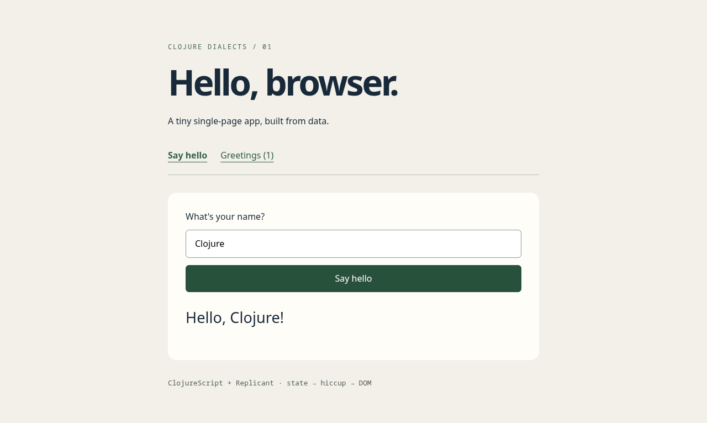

# ClojureScript + Replicant SPA

A browser app with a greeting form and a history route. An atom owns the state,
a pure function produces hiccup, and Replicant updates the DOM. Hash navigation
keeps the app and its in-memory history alive without page reloads. This uses
Replicant, not React itself.

Requires Java and Clojure CLI to build.

```sh
cd examples/clojurescript
clojure -M:build
```

Open [public/index.html](public/index.html) directly in your browser using
`file://`—no local server is needed. Enter a name and press **Say hello**. Visit
**Greetings** to see the history. Reloading the page intentionally resets state.
For development, run `clojure -M:dev` and refresh the same file after edits.

Verified on Linux ARM64, 2026-09-11: production and development builds opened
via `file://` in Chromium. Greeting, blank-name fallback, literal HTML handling,
history, browser back navigation, and clearing history passed without browser
errors. Assets use relative paths and navigation uses URL hashes.



Sources: [Replicant](https://github.com/cjohansen/replicant), versions in
[deps.edn](deps.edn).
