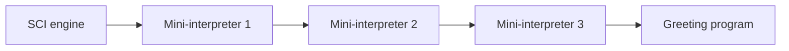

# An interpreter interpreting itself, inside SCI

A small Clojure-subset interpreter is written entirely in the subset it
implements. SCI runs the first copy, which can interpret another copy, which
can interpret another, eventually evaluating a greeting.

Requires Babashka; verified with **v1.13.219** on Linux ARM64 with an
8 MiB process stack. Available depth depends on platform and stack size.

```sh
cd examples/sci-tower
bb demo 3
# SCI → 3 mini-interpreter layer(s)
# "Hello, world!"
# Elapsed: ... ms

bb ladder  # compare depths 0 through 4
bb test    # 32 assertions
```

Depth 0 evaluates the greeting directly in SCI. Depth 1 runs one mini-interpreter
in SCI; depth 2 has that interpreter evaluate a second copy's source.



[tower.clj](tower.clj) reads [interpreter.clj](interpreter.clj) as data. Each
wrapper embeds the same interpreter expression and quotes the program for it
to evaluate. The runner then calls `sci/eval-string` **once**, on the whole tower.
The mini-interpreter has no `eval`, SCI API, compiler or loader available.
Babashka itself also uses SCI to run the harness; that ambient hosting layer is
excluded from the displayed depth.

This demonstrates self-interpretation of the mini-language. It does **not** load
SCI's own implementation into SCI. All layers share host primitive operations
such as arithmetic and immutable collection operations; interpreted function
bodies, closures and expression dispatch go through the lower interpreter.

## The language subset

- `quote`, `if`, sequential `let`, anonymous/named `fn`, and `throw`.
- Lexical scope and named recursion, with fixed arity.
- Function application, evaluated vector elements, scalar literals and quoted data.
- The small primitive environment listed in `tower/primitive-names`.

`fn` and `let` accept one body expression. There is no `def`, namespace system,
user macro expansion, destructuring, variadic dispatch, `loop/recur`, or tail-call
optimization. Maps and sets are treated as literal data; use `hash-map` when
values need evaluation. Interpreted closures are tagged vectors, not host
functions; host higher-order functions such as primitive `apply` cannot invoke
those closures directly. This is an educational interpreter, not a Clojure
compatibility layer or a security sandbox.

For example, from a Babashka REPL started here:

```clojure
(require '[tower :as tower])
(tower/run 3
  '((fn factorial [n]
      (if (<= n 1) 1 (* n (factorial (- n 1)))))
    5))
;; => 120
```

## Verification

On 2026-09-11, `bb test` passed **32 assertions**:

- The greeting is identical at depths 0–4.
- Factorial, lexical capture despite shadowing, sequential bindings, vector
  evaluation, quoted code and conditional branch selection work at depths 0–3.
- Unbound-symbol and closure-arity errors propagate at depths 1–3.

Four nested copies took approximately half a second in the initial check;
shallower runs took milliseconds. Timings are illustrative, not benchmarks.
The runner accepts any nonnegative depth, but added layers rapidly multiply
work and can exhaust the stack or memory. Depth 4 passed in the environment
above; it is not a portable supported limit. `bb demo 5` reproduces
`java.lang.StackOverflowError` even with that 8 MiB stack. On the same VM, reducing the stack
to 2 MiB reproduced `java.lang.StackOverflowError` at depth 4:

```sh
(ulimit -s 2048; bb demo 4)
```

If a run overflows, use a smaller depth (for example `bb demo 3`). Check
`bb --version` and `ulimit -s` when comparing machines. Increasing an allowed
stack limit may postpone failure; it does not fix the recursive evaluator.

Ordinary function calls here consume stack, even when in tail position.
Clojure/SCI's explicit `recur` is different, and this mini-language does not
implement it. Some evaluator calls are also non-tail calls, such as evaluating
an argument before assembling the argument list. Making arbitrary-depth
execution stack-safe would require restructuring the evaluator, for example
with explicit continuation frames and a dispatch loop, while preserving its
ability to interpret its own source.

Background: [SCI](https://github.com/babashka/sci) and its
[implementation limitations](https://github.com/babashka/sci#limitations).
