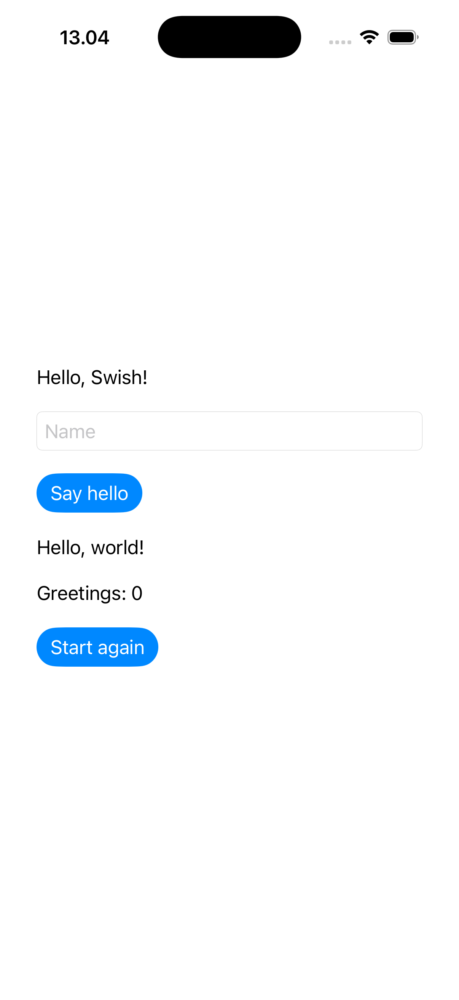

# Swish inside SwiftUI

Swish owns the application: an atom holds the name, greeting and click count;
`dispatch!` handles edits, greetings and resets; `screen` returns vectors
describing the native controls. All of that lives in
[greeting.swish](HelloSwish/Sources/GreetingCore/Resources/greeting.swish).

For example, `[:button :greet "Say hello"]` renders a native button that sends
the `:greet` event back to Swish. Swift only loads the interpreter, decodes
`[kind id text]` vectors, and renders text, fields and buttons in a SwiftUI stack.
This tiny renderer is part of the demo, not a built-in Swish UI library.
After each event it asks Swish for the screen again. User input and event names
are encoded as string literals at the interpreter boundary.

Type a name, press **Say hello**, and watch the greeting and counter change.
**Start again** resets the state. Change the script to rearrange controls or
change their behavior without editing Swift; rerun to load the bundled script.

## Directory structure

```text
HelloSwish/
├── Package.swift
├── Sources/
│   ├── GreetingCore/
│   │   ├── Greeting.swift            Swift ↔ Swish bridge
│   │   └── Resources/greeting.swish  State, events, and screen description
│   └── HelloSwish/
│       └── HelloSwish.swift          SwiftUI application and renderer
└── Tests/
    └── GreetingCoreTests/            Bridge and script tests
```

`GreetingCore` is a **Swift module**, declared as a target in
[Package.swift](HelloSwish/Package.swift). It is not a Clojure namespace;
`greeting.swish` has no `ns` declaration. The UI uses `import GreetingCore` to
access the bridge.

This split lets the tests exercise the script and bridge without opening a
SwiftUI window. It is an optional organization choice for this demo, not a
requirement of Swish. The script is declared as a package resource, so SwiftPM
bundles it and the bridge finds it using `Bundle.module` before loading it into
the interpreter.

## From Clojure data to SwiftUI

The Swish `screen` function reads the atom and returns vectors such as:

```clojure
[[:text :title "Hello, Swish!"]
 [:field :name "Ada"]
 [:button :greet "Say hello"]]
```

Each control follows the demo's `[kind id text]` convention. The `screen()`
method in [Greeting.swift](HelloSwish/Sources/GreetingCore/Greeting.swift)
evaluates `(screen)`, validates the vectors, and decodes them into Swift
`Element` values. For example:

```swift
Element(kind: "button", id: "greet", text: "Say hello")
```

The actual view construction happens in `ScriptView.body` in
[HelloSwish.swift](HelloSwish/Sources/HelloSwish/HelloSwish.swift). Its
`ForEach(elements)` loops over the controls and `switch element.kind` selects
the SwiftUI view:

| Swish control | SwiftUI view |
| --- | --- |
| `[:text :title "Hello"]` | `Text` |
| `[:field :name "Ada"]` | `TextField` with a binding that sends edits to Swish |
| `[:button :greet "Say hello"]` | `Button` that sends the `:greet` event |

Clicking the button makes the bridge evaluate `(dispatch! :greet "")`;
editing the field sends `(dispatch! :name "Ada")`. The Swish function updates
its atom accordingly. The vector format resembles Hiccup, but this renderer
is specific to the example: adding sliders or nested layouts would require
extending the Swift decoder and renderer.

## How the UI refreshes

There is **no watch or listener on the Swish atom**. After each event,
`ScriptView.send` explicitly fetches the new screen:

```swift
try engine.send(event, value: value)
elements = try engine.screen()
```

The `elements` property is declared with SwiftUI's `@State`:

```swift
@State private var elements: [Element] = []
```

Assigning the new elements tells SwiftUI to update the views. The initial screen
is fetched when the view loads; subsequent refreshes follow this cycle:

```text
Swish atom → (screen) → vectors → Swift elements → SwiftUI controls
    ↑                                                  │
    └──────────────── (dispatch!) ← interaction ────────┘
```

Reactivity therefore lives on the Swift side, with an explicit refresh after
each dispatched event. If the Swish atom changed independently, such as from a
background task, the UI would not automatically notice. That would require a
watch/callback or another mechanism to fetch `screen()` and update `elements`
on the UI thread.

## Run

On a Mac with Xcode and Swift 6.2 or later:

```sh
cd examples/swish/HelloSwish
swift test
swift run HelloSwish
```

For an Apple Silicon iOS simulator, from `examples/swish`:

```sh
xcrun simctl list devices available
SIMULATOR_ID=<your-iphone-simulator-udid> ./run-simulator.sh
open -a Simulator
```

The script builds for the ARM64 simulator, assembles an app with its resource
bundles, signs it locally, boots the selected simulator, installs and launches.
No developer account or Xcode project generator is required. It does not build
for a physical iPhone or distribute the app.

Verified 2026-09-11 on an Apple Silicon Mac reached from the Linux VM over SSH:

- macOS build and XCTest checks for the screen, editing, greeting count, reset, and default, named, Unicode, quoted, newline and slash input passed.
- iOS 26.5 simulator build, install and launch passed; the rendered screen displayed the greeting produced by Swish.
- Screenshot inspected; simulator typing/button interaction has not been automated.



Swish is pinned to commit
[`05f0de5`](https://github.com/infiniteNIL/swish/tree/05f0de5fe7755ec935dcd693dfb4c333c4cc0c33),
which supports Swift 6.2. Newer upstream commits require Swift 6.4; the tested
Xcode 26.5 installation supplies Swift 6.3.2. `Package.resolved` locks transitive
dependencies. Keep the `HelloSwish` package subdirectory: naming the root package
folder `swish` collides with the dependency's SwiftPM identity.
